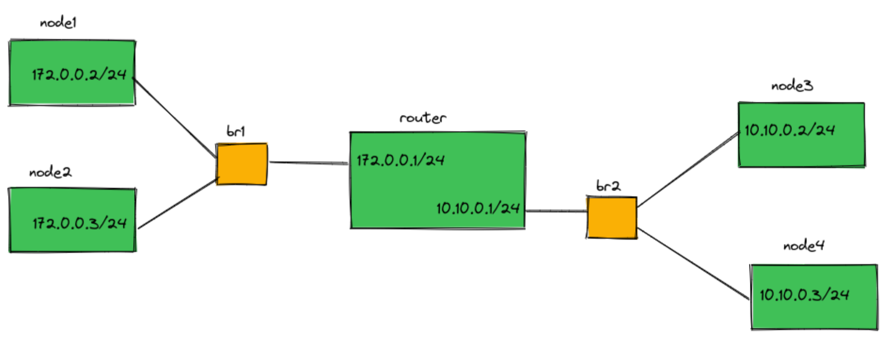
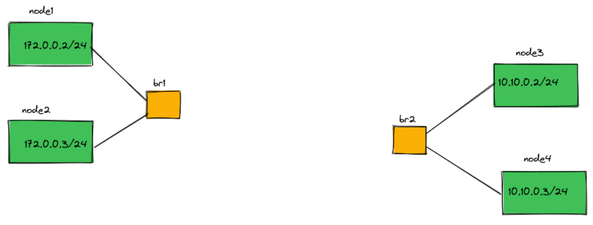
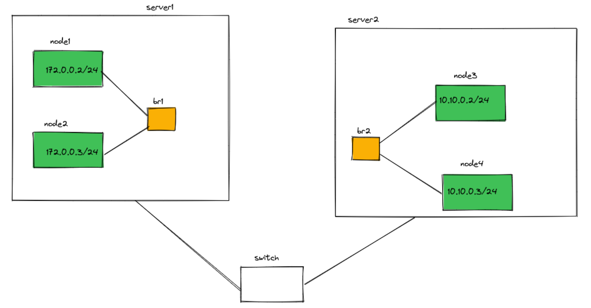

# Problem 1 (Container Networking) 45 points

## Question 2
Use Linux network namespaces and create the topology in the following figure:



*Figure 1: Network namespace topology with a router*

Each of the nodes and the router are in a different network namespace (not the root namespace). The bridges are in the root network namespace. You should provide a bash script that creates the topology.

When implementing your solution consider these:

- Every node must be able to ping every other node and the router.
- The 172.0.0.0/24 subnet can reach 10.10.1.0/24 only via the router and vice versa. So the router is the default gateway for all of the nodes.

You should provide another script that takes two node names as parameters and starts pinging the second node from the first one (the nodes are shown in green in figure 1). Suppose we run this command:```
./your-script.sh node1 router```

After running it node1 should start pinging the router and the output must be printed in the command line.

## Question 2
Now delete the router and its links to the bridges (Look at figure 2). How can we route packets from one subnet to another? Explain your solution (Including the rules in the root namespace. No implementation is required.).



*Figure 2: Network namespace topology without a router*

## Question 3
What if the namespaces are on different servers (virtual machine or physical server) that can see each other in layer 2 (Look at figure 3)? Explain your solution (Including the rules on the servers. No implementation is required.)



*Figure 3: Network namespace topology*

## Deliverables
- A bash script that creates the topology in figure 1 and another for pinging nodes.
- Two documents explaining your answers to questions regarding figures 2 and 3