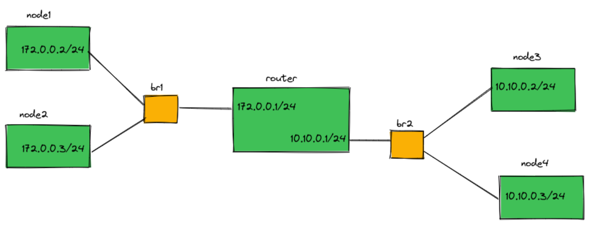
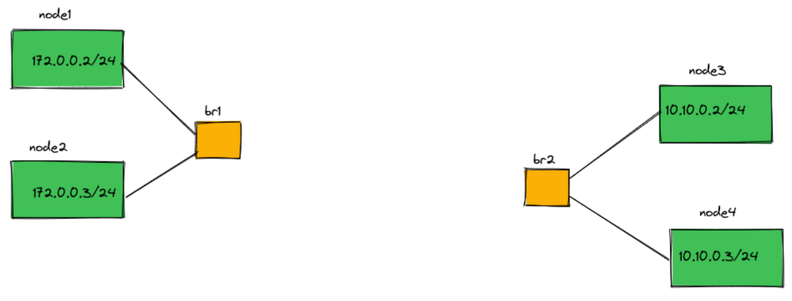
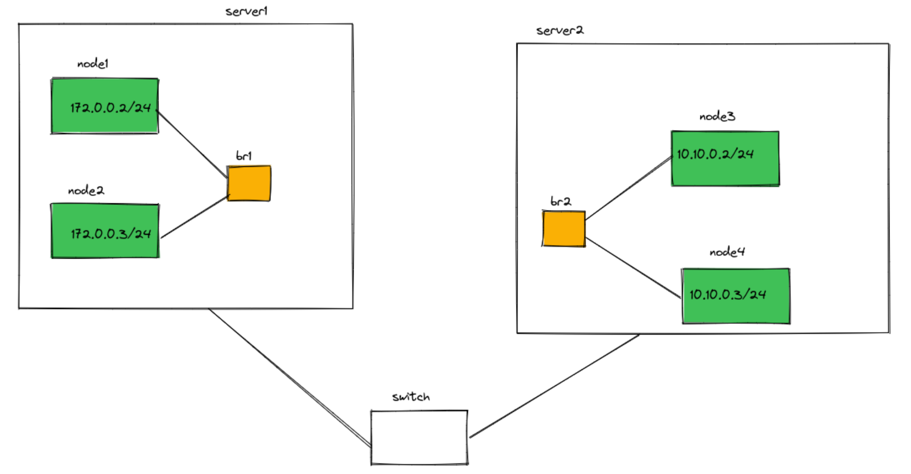

# Problem 1 (Container Networking) 45 points

## Question 2
Use Linux network namespaces and create the topology in the following figure:



*Figure 1: Network namespace topology with a router*

Each of the nodes and the router are in a different network namespace (not the root namespace). The bridges are in the root network namespace. You should provide a bash script that creates the topology.

When implementing your solution consider these:

- Every node must be able to ping every other node and the router.
- The 172.0.0.0/24 subnet can reach 10.10.1.0/24 only via the router and vice versa. So the router is the default gateway for all of the nodes.

You should provide another script that takes two node names as parameters and starts pinging the second node from the first one (the nodes are shown in green in figure 1). Suppose we run this command:```
./your-script.sh node1 router```

After running it node1 should start pinging the router and the output must be printed in the command line.

## Question 2
Now delete the router and its links to the bridges (Look at figure 2). How can we route packets from one subnet to another? Explain your solution (Including the rules in the root namespace. No implementation is required.).



*Figure 2: Network namespace topology without a router*

## Question 3
What if the namespaces are on different servers (virtual machine or physical server) that can see each other in layer 2 (Look at figure 3)? Explain your solution (Including the rules on the servers. No implementation is required.)



*Figure 3: Network namespace topology*

## Deliverables
- A bash script that creates the topology in figure 1 and another for pinging nodes.
- Two documents explaining your answers to questions regarding figures 2 and 3

# Problem Explanation
## Network Topology and Ping Explanation(Answer 1)

To create the network topology and run the ping tests, follow these steps:

1. Run the `create_topology.sh` script to create the network namespaces, virtual Ethernet pairs, and set up the network interfaces:

   ```bash
   ./create_topology.sh
   ```

   This script performs the following tasks:

   - Creates five network namespaces: `ns1`, `ns2`, `ns3`, `ns4`, and `router`.
   - Creates virtual Ethernet pairs and assigns them to the respective namespaces.
   - Brings up the network interfaces and assigns IP addresses to them.
   - Creates two bridges, `br1` and `br2`, and associates the virtual Ethernet pairs with the bridges.
   - Enables IP forwarding on the `router` namespace.
   - Runs some connectivity tests using `ping` commands.

2. Once the topology is set up, you can run the `ping.sh` script to test the connectivity between the nodes and the router:

   ```bash
   ./ping.sh <source_node> <destination_node> <number_of_pings>
   ```

   Here, `<source_node>` can be `node1`, `node2`, `node3`, `node4`, or `router`, and `<destination_node>` can be `node1`, `node2`, `node3`, `node4`, or `router`. `<number_of_pings>` specifies the number of ping packets to send.

   The `ping.sh` script determines the appropriate namespace and destination IP address based on the provided arguments, and then executes the `ping` command within the specified namespace.

The `delete_topology.sh` script can be used to clean up the created network namespaces and virtual Ethernet pairs:

```bash
./delete_topology.sh
```

This script deletes all the network namespaces and virtual Ethernet pairs created by the `create_topology.sh` script.

Explanation of the Topology and Ping:

The `create_topology.sh` script sets up a simple network topology with four nodes (`ns1`, `ns2`, `ns3`, and `ns4`) and a router (`router`). The nodes are connected to the router through virtual Ethernet pairs and bridges.

The `ping.sh` script allows you to test the connectivity between the nodes and the router. When you run the script, it determines the appropriate namespace and destination IP address based on the provided arguments, and then executes the `ping` command within the specified namespace.

For example, if you run `./ping.sh node1 node3 3`, the script will execute the following command:

```
ip netns exec ns1 ping -c3 10.10.0.2
```

This will ping the IP address `10.10.0.2` (which is the address of `node3`) from the `ns1` namespace (which is the namespace of `node1`).

The script also handles the case where the source or destination is the `router` namespace. In this case, it will use the appropriate IP address for the router's interfaces.